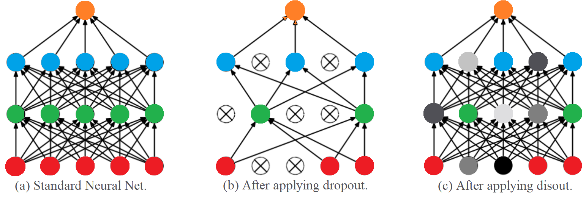

# Disout: Feature Map Distortion to Regularize Deep Neural Networks

This code is the Pytorch implementation of AAAI 2020 paper [Beyond Dropout: Feature Map Distortion to Regularize Deep Neural Networks](https://arxiv.org/abs/2002.11022).

Deep neural networks often consist of a great number of trainable parameters for extracting powerful features from given datasets. On one hand, massive trainable parameters significantly enhance the performance of these deep networks. On the other hand, they bring the problem of over-fitting. To this end, dropout based methods disable some elements in the output feature maps during the training phase for reducing the co-adaptation of neurons. Although the generalization ability of the resulting models can be enhanced by these approaches, the conventional binary dropout is not the optimal solution. Therefore, we investigate the empirical Rademacher complexity related to intermediate layers of deep neural networks and propose a feature distortion method (Disout) for addressing the aforementioned problem. In the training period, randomly selected elements in the feature maps will be replaced with specific values by exploiting the generalization error bound. The superiority of the proposed feature map distortion for producing deep neural network with higher testing performance is analyzed and demonstrated on several benchmark image datasets.

<p align="center">

</p>


## Requirements

- python 3
- pytorch >= 1.0.0
- torchvision

## Usage

Disout is a flexible block that can insert into deep neural networks and improve their generalization ability. To achieve the optimal performance, the following three hyper-parameters should be adjusted.

```
dist_prob: probability of an element to be distorted.

block_size: size of the block to be distorted.

alpha: the intensity of distortion.
```


Here we provide a simple example to illustrate how to implement disout in neural networks. Take ResNet-56  on CIFAR-10 as an example:

```python
python train.py
```

## Result

You should get about 94.50% accuracy on CIFAR-10 dataset when using the default parameter.

## Citation

	@article{tang2020beyond,
	  title={Beyond Dropout: Feature Map Distortion to Regularize Deep Neural Networks},
	  author={Tang, Yehui and Wang, Yunhe and Xu, Yixing and Shi, Boxin and Xu, Chao and Xu, Chunjing and Xu, Chang},
	  journal={arXiv preprint arXiv:2002.11022},
	  year={2020}
	}

## Contributing

We appreciate all contributions. If you are planning to contribute back bug-fixes, please do so without any further discussion.

If you plan to contribute new features, utility functions or extensions to the core, please first open an issue and discuss the feature with us. Sending a PR without discussion might end up resulting in a rejected PR, because we might be taking the core in a different direction than you might be aware of.
